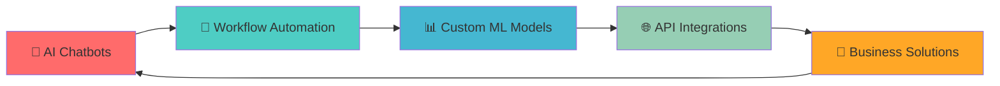

```markdown
<div align="center">

# 🚀 KANISHK KUMAR SACHAN 🚀
```
██╗  ██╗ █████╗ ███╗   ██╗██╗███████╗██╗  ██╗██╗  ██╗
██║ ██╔╝██╔══██╗████╗  ██║██║██╔════╝██║  ██║██║ ██╔╝
█████╔╝ ███████║██╔██╗ ██║██║███████╗███████║█████╔╝ 
██╔═██╗ ██╔══██║██║╚██╗██║██║╚════██║██╔══██║██╔═██╗ 
██║  ██╗██║  ██║██║ ╚████║██║███████║██║  ██║██║  ██╗
╚═╝  ╚═╝╚═╝  ╚═╝╚═╝  ╚═══╝╚═╝╚══════╝╚═╝  ╚═╝╚═╝  ╚═╝
```

[](https://git.io/typing-svg)


</div>

---

## 🎯 **ABOUT ME** 
```yaml
name: Kanishk Kumar Sachan
role: AI Engineer & Automation Specialist
location: India 🇮🇳
current_focus: Building intelligent automation systems
specialties: [AI Chatbots, Workflow Automation, ML Models, API Integration]
always_learning: true
coffee_dependency: high ☕
```

<div align="center">

### 🤖 **CORE EXPERTISE**

<table>
<tr>
<td align="center" width="200px">

<br><strong>AI Automation</strong>
<br>Workflow Intelligence
</td>
<td align="center" width="200px">

<br><strong>Chatbot Development</strong>
<br>Voice Integration
</td>
<td align="center" width="200px">

<br><strong>ML Engineering</strong>
<br>Custom Models
</td>
<td align="center" width="200px">

<br><strong>API Integration</strong>
<br>Google Workspace
</td>
</tr>
</table>

</div>

---

## 🛠️ **TECH ARSENAL**

<div align="center">

### 🔥 **Core Technologies**


### 🤖 **AI & Automation**


### 📊 **Data & ML**


### 🔧 **Development & Deployment**


</div>

---

## 🎮 **SPECIALTY SKILLS**

<div align="center">

```ascii
┌─────────────────────────────────────────────────────────────┐
│  🤖 AI CHATBOT DEVELOPMENT    │  🔄 WORKFLOW AUTOMATION      │
│  ├─ Discord Bot Integration   │  ├─ Google Workspace APIs    │
│  ├─ Voice Recognition         │  ├─ Email Automation         │
│  ├─ Natural Language Proc.    │  ├─ Calendar Management      │
│  └─ Custom ML Models          │  └─ Document Processing      │
│                               │                               │
│  📸 COMPUTER VISION           │  🧠 MACHINE LEARNING          │
│  ├─ Screenshot Analysis       │  ├─ Custom Model Training    │
│  ├─ Image Processing          │  ├─ Deep Learning            │
│  ├─ OCR Integration           │  ├─ Neural Networks          │
│  └─ Object Detection          │  └─ Model Deployment         │
└─────────────────────────────────────────────────────────────┘
```

</div>

---

## 📊 **GITHUB ANALYTICS**

<div align="center">


</div>

---

## 🏆 **NOTABLE PROJECTS**

<div align="center">

| 🚀 Project | 📝 Description | 🛠️ Tech Stack | ⭐ Status |
|------------|----------------|---------------|-----------|
| **[Knowledge Graph](https://github.com/koopatroopa787/Knowledge_graph)** | Advanced knowledge graph for intelligent data connections | Python, NetworkX, ML |  |
| **[Google Colab Collection](https://github.com/koopatroopa787/Google-colab)** | AI/ML experiments and model implementations | Python, TensorFlow, PyTorch |  |
| **[My Projects Portfolio](https://github.com/koopatroopa787/myprojects)** | Diverse AI and ML capability demonstrations | Multi-tech |  |
| **[AMD Pervasive AI](https://github.com/koopatroopa787/AMD-pervasive-AI)** | Cutting-edge AI models for AMD architectures | Python, AMD ROCm |  |

</div>

---

## 🎯 **CURRENT FOCUS**

<div align="center">



</div>

<details>
<summary>🔍 <strong>Current Learning Path</strong></summary>

- 🧠 **Advanced NLP**: Fine-tuning transformer models
- 🤖 **AI Agents**: Building autonomous workflow systems  
- 🔊 **Voice AI**: Real-time speech processing and synthesis
- 🌐 **LLM Integration**: Custom ChatGPT and Claude implementations
- ⚡ **Performance Optimization**: Model quantization and edge deployment

</details>

---

## 🌐 **CONNECT WITH ME**

<div align="center">

[](https://www.linkedin.com/in/kanishk-kumar-sachan-36114a197/)
[](https://x.com/Kanishk11486111)
[](mailto:yashk242810@gmail.com)
[](https://fiverr.com/your-profile)


</div>

---

## 💭 **PHILOSOPHY**

<div align="center">

*"Building AI systems that don't just work, but work intelligently"*


</div>

---

<div align="center">

### 🎮 **Fun Fact**
```
while(alive) {
    eat();
    sleep();
    code();
    repeat();
}
```


**Thanks for visiting! Let's build something amazing together! 🚀**

</div>
```
