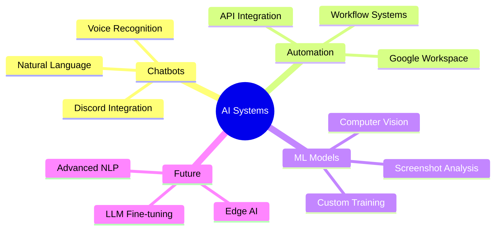

<div align="center">


[](https://git.io/typing-svg)

</div>

---

## 🚀 **Who Am I?**

<div align="center">

```javascript
const kanishk = {
    role: "AI Engineer & Automation Specialist",
    location: "India 🇮🇳",
    specializes_in: [
        "🤖 AI Chatbot Development",
        "🔄 Workflow Automation",
        "📊 Custom ML Models", 
        "🎤 Voice Integration",
        "📷 Screenshot Analysis"
    ],
    currently_building: "Intelligent automation systems",
    coffee_level: "Maximum ☕",
    fun_fact: "I automate things faster than I can explain them"
};
```

</div>

---

## 🛠️ **Tech Arsenal**

<div align="center">

### 🔥 **Core Stack**


### 🤖 **AI & Automation**


### 📊 **Data & ML**


</div>

---

## 📊 **GitHub Analytics**

<div align="center">


</div>

---

## 🔥 **Activity & Streaks**

<div align="center">


</div>

---

## 🎯 **Featured Projects**

<div align="center">

[](https://github.com/koopatroopa787/Knowledge_graph)
[](https://github.com/koopatroopa787/Google-colab)

[](https://github.com/koopatroopa787/myprojects)
[](https://github.com/koopatroopa787/AMD-pervasive-AI)

</div>

---

## 💡 **Current Focus**

<div align="center">



</div>

---

## 🏆 **GitHub Trophies**

<div align="center">


</div>

---

## 📈 **Contribution Graph**

<div align="center">


</div>

---

## 🌐 **Connect With Me**

<div align="center">

[](https://www.linkedin.com/in/kanishk-kumar-sachan-36114a197/)
[](https://x.com/Kanishk11486111)
[](mailto:yashk242810@gmail.com)
[](https://fiverr.com/your-profile)


</div>

---

<div align="center">

### 💭 *"Code. Train. Automate. Repeat."*


</div>
